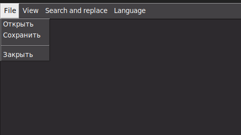
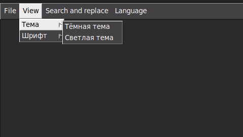
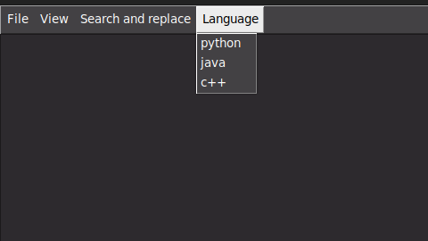

#Text_Editor_Python

В этом проекте я реаализовал Текстовый редактор с поддержкой подсветки синтаксиса языков программирования

В файле text_editor.py описана реализация графического интерфейса: создание окон, добавление горячих клавиш, реализация смены темы и шрифта и поиска с заменой 
В файле file_editor.py описаны реализация функций для редактирования текста
В файле syntax_highlighter.py реализованы функции для поддержки подсветки синтаксиса с учётом смены её во время написания текста

#Функционал:

1. Графический интерфейс: само поле для ввода текста и меню на верхней панели  
На панели есть:  
    В разделе File: сохранение , открытие файла и закрытие окна  
    
      
    
    В разделе View: можно выбрать шрифт(times New Roman, Arial, ComicSans MS) и тему(тёмная и светлая)  
    
      
    
      
    
    В разделе Search and replace: поиск с заменой  
    
      
    
    В разделе Language: можно выбрать язык для переключения подсветки синтаксиса  
    
      

Также есть горячая клавиша для закрытия окна: ctrl + q.  

2. Работа с текстовым файлом: сохранение, открытие других файлов(этим функциям соответствуют горячие клавиши ctrl + s и ctrl + o)  

3. Редактирование текста: использование горячих клавиш:  

    3.1. ctrl + a - выделение всего текста  

    3.2. ctrl + d - удалени строки  

    3.3. ctrl + w - удаление слова  

    3.4. ctrl + right/left/home/end - перемещение по тексту  

    3.5. ctrl + f - поиск по тексту и замена  

#Как запускать  

В репозитории лежит файл Makefile в котором прописана команда , но я посчитал , что проще прописать make для запуска программы  

```
make
```

или  

```
python3 main.py
```
  
#Подключение ЯП  
  
В репозитории есть файл config.json в которм описаны правила некоторого ключевого синтаксиса для трёх языков: python, c++, java. Для того чтобы добавить новый язык, нужно разбить его на разделы, как там прописано, и выбрать свой язык на панели меню.  

  

#Команды для установки библиотек  

```
pip install tk
```  

```
pip install re
```  

```
pip install json
```  

```
pip install os
```  